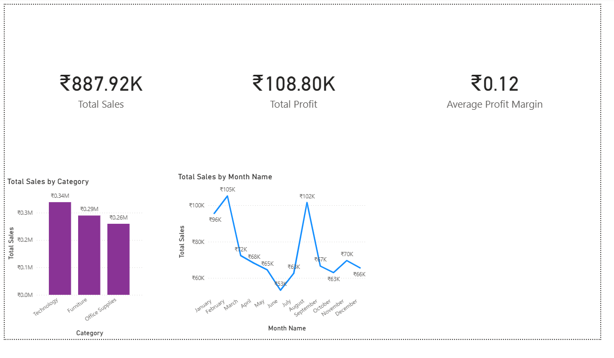

# Retail Sales Performance Dashboard

## Project Purpose
This dashboard provides insights into retail sales performance by month, category, and region. It is designed to help retail managers and analysts quickly identify trends and make data-driven decisions.

## 📊 Dataset
- Source: [Specify, e.g., Kaggle - Retail Sales Dataset or company internal data]
- Time period: [e.g., Jan 2023 - Dec 2023]
- Measures included:
  - Sales
  - Profit
  - Quantity Sold
  - Profit Margin

## 🛠 Tools Used
- Microsoft Power BI — for building the dashboard
- Microsoft Excel — for data cleaning & preprocessing

## 🚀 Progress
- [x] Data cleaning completed
- [x] Dashboard visuals created
- [ ] KPI cards in progress

## 📷 Preview

